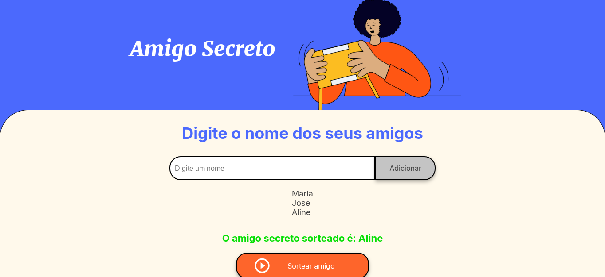

# Amigo Secreto 🎁

Um projeto simples para realizar sorteios de "Amigo Secreto". Adicione os nomes dos participantes, verifique se o número de nomes é ímpar e realize o sorteio de forma interativa!

## Funcionalidades ✨

- **Adicionar Nomes**: Insira os nomes dos participantes no campo de texto e clique em "Adicionar" para incluí-los na lista.
- **Verificação de Número Ímpar**: O sistema verifica se o número de participantes é ímpar antes de permitir o sorteio.
- **Sorteio Interativo**: Clique em "Sortear" para exibir um nome por vez. O nome sorteado é exibido com a mensagem: "O amigo secreto sorteado é: [nome sorteado]".
- **Evitar Repetições**: Cada nome só pode ser sorteado uma vez.

## Como Usar 🚀

1. **Adicionar Nomes**:
   - Digite o nome de um participante no campo de texto.
   - Clique em "Adicionar" para incluí-lo na lista.
   - Repita o processo até adicionar todos os participantes.

2. **Realizar o Sorteio**:
   - Certifique-se de que o número de participantes seja ímpar.
   - Clique em "Sortear" para exibir um nome por vez.
   - O nome sorteado será exibido na tela.

3. **Reiniciar**:
   - Para realizar um novo sorteio, adicione novos nomes ou recarregue a página.

## Capturas de Tela 📸

### Tela Inicial

*Tela inicial do projeto, com campo para adicionar nomes e botão de sorteio.*

### Adicionando Nomes

*Adicionando nomes à lista de participantes.*

### Sorteio Realizado

*Resultado do sorteio exibindo o nome sorteado.*

## Vídeo Demonstrativo 🎥

[Assista ao vídeo demonstrativo](https://youtu.be/lUoulLyZZjo)

## Tecnologias Utilizadas 💻

- **HTML**: Estrutura da página.
- **CSS**: Estilização e design responsivo.
- **JavaScript**: Lógica para adicionar nomes e realizar o sorteio.

## Como Contribuir 🤝

1. Faça um **fork** do projeto.
2. Crie uma branch para sua feature: `git checkout -b minha-feature`.
3. Commit suas alterações: `git commit -m 'Adicionando nova funcionalidade'`.
4. Envie as alterações: `git push origin minha-feature`.
5. Abra um **Pull Request** para revisão.

## Licença 📜

Este projeto está licenciado sob a [MIT License](MIT%20License).

https://youtu.be/lUoulLyZZjo
